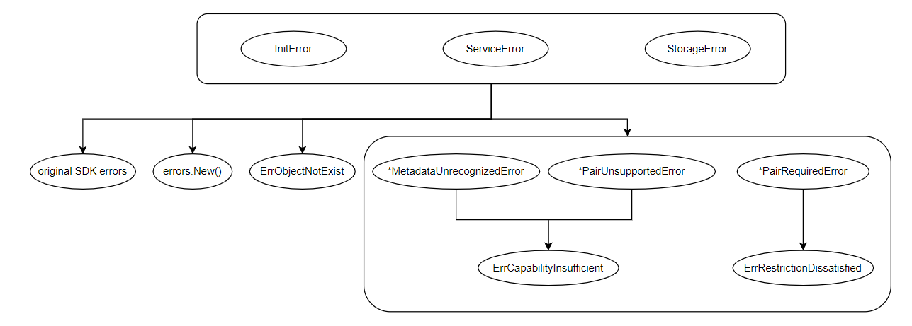
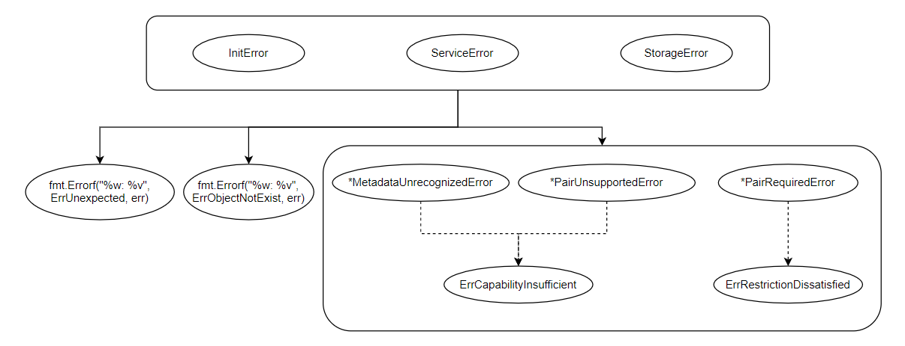

# AOS-47: Better Error Handling

## Background

### AOS-11

`11-error-handling` proposed that in the top level, [go-storage] should return custom error `struct`s carrying contextual errors. Specifically, the `struct`s will have the following definitions:

```go
type SomeError struct {
	Op  string
	Err error

	ContextA string
	ContextB structB
	...
}
```

The `Err` field wraps the cause of the error. 
- For unexpected error, it will be wrapped directly. 
- For expected error, the related error should be used directly.

### Current Practice

Currently, the error handling mechanism in [go-storage] can be summarized as below:

- top-level error `struct`s (returned by public APIs): `InitError`, `ServiceError` and `StorageError`
	- defined in [go-storage/services/error.go]
	- have `Op`, `Err` and context fields
	- returned in `defer` in `go-service-*`s' public APIs
		- Public APIs in `generated.go` (generated by `service.tmpl`) call `s.formatError` in `defer`. So the implementor should implement `formatError` method for `Storage` (and `Service` maybe) where `StorageError` (or `ServiceError`) is returned.
		- For other handwritten public APIs like `New`, the implementor should similarly return a top-level error like `InitError`.
	- They are orthogonal (won't wrap each other).

- `Err`s wrapped are either:
  - unexpected errors: original SDK errors: `*googleapi.Error`, `*qserror.QingStorError`, ...
  - expected errors, either:
    - ad-hoc string errors: `errors.New()` or `fmt.Errorf()` without `%w` verb
    - sentinel errors wrapped by `fmt.Errorf` with `%w`: 
    	- defined in either [go-storage/services/error.go] or `go-service-*/error.go`
    	- defined as `var ErrSomethingWrong = errors.New("what happened")`
    	- returned in `fmt.Errorf("%w: %v", services.ErrObjectNotExist, err)`, carrying error messages of original SDK errors
    - another layer of error `struct`s carrying contextual information: `MetadataUnrecognizedError`, `PairUnsupportedError`, `PairRequiredError`
    	- defined in [go-storage/services/error.go]
    	- have `Err` and context fields, don't have `Op`
    	- returned by constructor methods, where `Err` is set to a sentinel error, which can be viewed as the error `struct`s' classification


### Problems

#### Unexpected Errors: Abstraction Leak

Wrapping (partial) SDK errors will lead to abstraction leak. In terms of error handling, being vendor agnostic means we should provide a unified custom error to hide the SDK errors, e.g., we convert some SDK errors into our `ErrObjectNotExist`. However, unexpected errors will be wrapped directly. It is possible that users use `errors.Is` & `errors.As` targeting SDK errors. Then problems will come when we add a new kind of expected error and convert some SDK errors into it. It may be confusing that some SDK errors are wrapped, while the others are not. Below is an example of such partial conversion.

```go
func formatError(err error) error {
	e, ok := err.(awserr.RequestFailure)
	if !ok {
		return err
	}

	switch e.Code() {
	// AWS SDK will use status code to generate awserr.Error, so "NotFound" should also be supported.
	case "NoSuchKey", "NotFound":
		return fmt.Errorf("%w: %v", services.ErrObjectNotExist, err)
	case "AccessDenied":
		return fmt.Errorf("%w: %v", services.ErrPermissionDenied, err)
	// What if we add a new case, but users already handle it themselves?
	}

	return err
}
```

Although we declared in `11-error-handling` that unexpected errors could be changed or disappeared while dependence upgraded and no changelog for them, we'd better simply eliminate the possibility of using them.

#### Expected Errors

`11-error-handling` is not detailed enough. It does not specify how to define and use expected errors. Current practice has too many cases, and has some problems. Both users and implementors may be confused which kind of error should be returned at which place.

- Ad-hoc string errors are not user-friendly. The user cannot use `errors.Is` & `errors.As` to handle such errors specially. We should avoid using them.

- Another layer of error `struct`s may be confusing.
  - It may be mistaken for top-level errors.
  - Their `Err` fields are also confusing.
    - Will they wrap yet another layer of error `struct`s? 
    - If it will be the same for all instances, not intended for the caller to fill in, and only accessed via `Unwrap`, we can actually hide the field.
    - The wrapped errors seem like the super class. It may be more reasonable to wrap other errors instead of being wrapped. But the order does not matter in the error chain.

## Proposal

So I propose the following error handling specification as a supplement of `11-error-handling`:

1. Public APIs SHOULD return top-level errors, which MUST be defined as below:
	```go
	type SomeError struct {
		Op  string
		Err error

		ContextA string
		ContextB structB
		...
	}
	```
2. For the wrapped error:
   - If it is an unexpected error, it MUST be `fmt.Errorf("%w: %v", ErrUnexpected, err)`
     - `ErrUnexpected` is defined as: `var ErrUnexpected = errors.New("go-storage can't handle this error")`. 
     - SDK errors SHOULD not be wrapped.
   - If it is an expected error, it MUST be either
     - an exported public variable containing an `error` value created by `errors.New()` (a.k.a. a sentinel error)
       - `var SomeError = errors.New("what happened")`
     - `NewSomeError(contextA, contextB)` where 
       - `SomeError` is returned and it is defined as:
			```go
			type SomeError struct {
				ContextA string
				ContextB structB
				...
			}
			```
       - `SomeError` SHOULD implement `Error`
       - `SomeError` CAN implement `Unwrap`, returning the category (or the label) of the error, which is a sentinel error
     - `fmt.Errorf("%w: %v", SomeError, err)` if the expected error is caused by another `error` value
       - `SomeError` is one of the two kind of errors above
       - `err` is the original error
     
Real examples of expected errors:

Definitions:
```go
var (
	// ErrCapabilityInsufficient means this service doesn't have this capability
	ErrCapabilityInsufficient = errors.New("capability insufficient")

	// ErrObjectNotExist means the object to be operated is not exist.
	ErrObjectNotExist = errors.New("object not exist")
)

// NewPairUnsupportedError will create a new PairUnsupportedError.
func NewPairUnsupportedError(pair types.Pair) *PairUnsupportedError {
	return &PairUnsupportedError{
		Pair: pair,
	}
}

// PairUnsupportedError means this operation has unsupported pair.
type PairUnsupportedError struct {
	Pair types.Pair
}

func (e *PairUnsupportedError) Error() string {
	return fmt.Sprintf("pair unsupported, %s: %s", e.Pair, ErrCapabilityInsufficient.Error())
}

// Unwrap implements xerrors.Wrapper
func (e *PairUnsupportedError) Unwrap() error {
	return ErrCapabilityInsufficient
}
```



In short, compared with current practice, there are three changes:
1. Ad-hoc string errors SHOULD not be used.
2. SDK errors SHOULD not be wrapped.
3. Wrapped error `struct`s won't wrap another layer of error `struct`s, and its wrapped `Err` is hidden.

Besides, we should list all available errors in the docs.

### Where to define expected errors

Top-level errors SHOULD be defined in [go-storage].

For wrapped errors, if an error is related to a feature supported by service pairs, e.g., server-side encryption, it is considered a service-specific error and should be defined in `go-service-*`. Otherwise, it should be defined in [go-storage].

### Alternative 1: Single Top-level Error and Multiple Middle-level Errors

We can provide a single top-level `Error` type as below, and old top-level errors are turned into middle-level errors.

```go
type Error struct {
	Op string
	Err error
}
```

And we allow zero or more error `struct`s to be nested.

#### Pros

- The user can get `Op` by `As(Error)`, instead of figuring out which top-level error it is. (But `Op` may be rare to be need elsewhere than in an error message.)
- What's more, we can add more common fields like HTTP status code in the top-level error.
- Multiple middle-level errors are more expressive.

#### Cons 

- Introduce break change.
- Too many levels may be too complex both for implementors and users.

### Alternative 2: Wrapping all SDK errors

Wrapping SDK errors partially is bad. Then besides never wrapping them, we can also always wrap them. 

#### Pros 

- Do not lose error information.
- The user can handle original SDK errors transparently with `As` & `Is`.

#### Cons

- Introduce break change: former bottom-level sentinel errors like `ErrObjectNotExist` should wrap an original error now.

## Rationale

First, it is necessary to state more clearly the current practice and turn it into a specification.

The current situation has almost reached the goal of letting users know "where" and "why" an error happens:
- The top-level errors' `Op` and their names tell users "where".
- The context fields and the wrapped error can provide rich error message, telling users "why".

But we can do more: let users handle error gracefully. The following can be done:
- Help users quickly identify errors: 
  - Ad-hoc string error can not be identified, so we should ban them.
  - If we have too many levels, the users may use too general or too specific errors. We should provide proper granularity. The proposal's granularity can be described as:
    - Top-level errors decide which component the errors belong to.
    - Wrapped errors are specific. There isn't a more specific error type.
    - If some wrapped errors can be grouped together, their `Unwrap` will return a sentinel error representing the category.
- Provide a unified user experience: define an abstract layer of errors for the users, free them of the tedium of handling similar errors from multiple SDKs.

## Compatibility

The following changes will be made:
- Extract some ad-hoc string errors into defined sentinel errors. (forward compatible)
- Turn SDK errors into `fmt.Errorf("%v", err)`. (not forward compatible, but doesn't violate our promise)
- Some error `struct`s' `Err` field will be removed. (not forward compatible)

## Implementation

Most of the work would be done by the author of this proposal.

[go-storage]: https://github.com/aos-dev/go-storage
[go-storage/services/error.go]: https://github.com/aos-dev/go-storage/blob/master/services/error.go